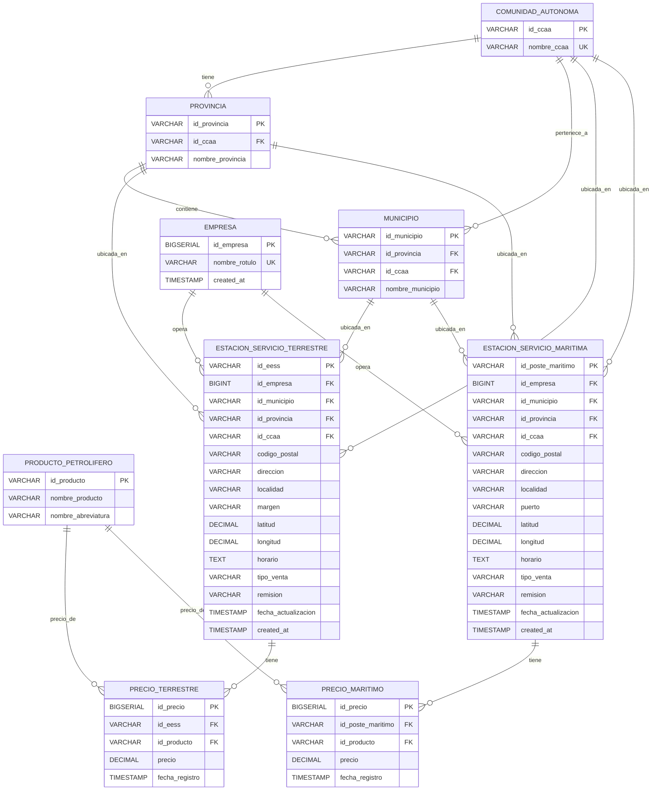

# Diagrama Entidad/Relación - Sistema de Estaciones de Servicio

Este documento contiene el diagrama entidad/relación del sistema de gestión de estaciones de servicio.

## Diagrama ER (Mermaid)

## Descripción de Entidades

### Tablas de Referencia Geográfica

- **COMUNIDAD_AUTONOMA**: Comunidades autónomas de España
- **PROVINCIA**: Provincias de España (pertenecen a una comunidad autónoma)
- **MUNICIPIO**: Municipios de España (pertenecen a una provincia y comunidad autónoma)

### Tablas de Referencia de Negocio

- **EMPRESA**: Empresas operadoras de estaciones de servicio
- **PRODUCTO_PETROLIFERO**: Productos petrolíferos disponibles (Gasolina 95 E5, Gasóleo A, etc.)

### Tablas de Estaciones Terrestres

- **ESTACION_SERVICIO_TERRESTRE**: Estaciones de servicio terrestres con información de ubicación y coordenadas GPS
- **PRECIO_TERRESTRE**: Precios de productos en estaciones terrestres (relación muchos a muchos entre estaciones y productos)

### Tablas de Estaciones Marítimas

- **ESTACION_SERVICIO_MARITIMA**: Estaciones de servicio marítimas (postes marítimos) con información de puerto
- **PRECIO_MARITIMO**: Precios de productos en estaciones marítimas (relación muchos a muchos entre estaciones y productos)

## Cardinalidades

- **1:N**: Una comunidad autónoma tiene muchas provincias
- **1:N**: Una provincia contiene muchos municipios
- **1:N**: Una empresa opera muchas estaciones (tanto terrestres como marítimas)
- **1:N**: Una estación tiene muchos precios (uno por producto)
- **1:N**: Un producto tiene muchos precios (uno por estación)

## Notas Importantes

- Las claves primarias están marcadas como **PK**
- Las claves únicas están marcadas como **UK**
- Las claves foráneas están marcadas como **FK**
- Los tipos de datos están simplificados (VARCHAR, DECIMAL, BIGSERIAL, TIMESTAMP)
- Las relaciones de eliminación son principalmente `ON DELETE RESTRICT` para mantener la integridad referencial
- Los precios se eliminan en cascada cuando se elimina una estación (`ON DELETE CASCADE`)

